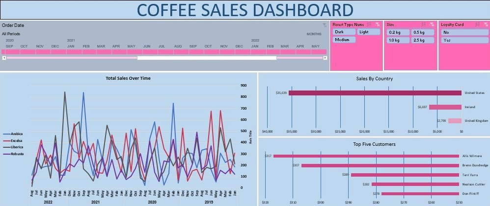
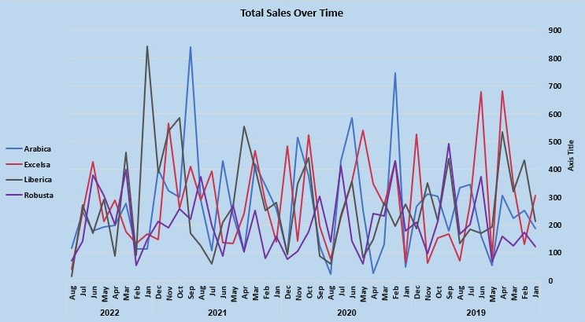
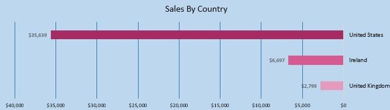
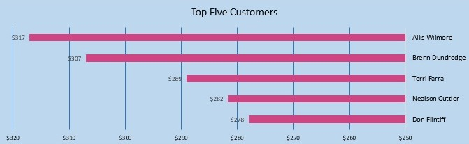

# ☕ Coffee Sales Analysis & Interactive Excel Dashboard

An end-to-end business analytics project — from raw transactional data to a decision-ready interactive dashboard — built entirely in Microsoft Excel.



---

## 1. Business Context

A specialty coffee retailer sells four coffee varieties (Arabica, Excelsa, Liberica, Robusta) across three markets (United States, Ireland, United Kingdom) in multiple roast types and package sizes. Management needed a self-serve way to answer recurring questions — *Which markets and customers drive revenue? What product attributes sell best? How is demand trending over time?* — without waiting on ad-hoc spreadsheet requests.

**Objective:** Turn 1,000 raw order-line records into a clean, well-modeled dataset and a single interactive dashboard that non-technical stakeholders can filter and explore themselves.

## 2. Dataset

| Table | Description | Rows |
|---|---|---|
| `Orders` | Transaction-level order lines (date, product, quantity, price, customer, revenue) | 1,000 |
| `Customers` | Customer master data (name, contact, address, country, loyalty status) | 1,000 |
| `Products` | Product catalog (coffee type × roast type × size, unit price, cost, profit) | 48 |

- **Time span:** January 2019 – August 2022
- **Markets:** United States, Ireland, United Kingdom
- **Product dimensions:** 4 coffee types × 3 roast levels × 4 package sizes

Source files: [`data/raw/Raw_Dataset.xlsx`](data/raw/Raw_Dataset.xlsx) (as received) → [`data/processed/Coffee_Sales.xlsx`](data/processed/Coffee_Sales.xlsx) (cleaned, modeled, dashboard).

## 3. Data Cleaning & Preparation

Performed in Excel prior to analysis:

- Removed duplicate order lines and inconsistent records
- Standardized date fields and numeric formats (currency, quantity, sizes)
- Reconciled product codes across `Orders` and `Products` using a consistent `ProductID` key (`CoffeeType-RoastType-Size`)
- Derived fields: `Sales` (Quantity × UnitPrice), `CoffeeTypeNames`, `RoastTypeName` for readable labels
- Validated referential integrity between `Orders`, `Customers`, and `Products` tables

## 4. Methodology

- Built a relational structure across three tables using lookups and consistent keys (star-schema style, within Excel)
- Used **PivotTables** to aggregate sales by time period, country, customer, and product attribute
- Built **PivotCharts** and slicers (Roast Type, Size, Loyalty Card, Order Date) for interactive, filterable exploration
- Calculated KPIs directly from pivoted data rather than manual formulas, so the dashboard recalculates automatically as filters change

## 5. Key Metrics (Full Period, 2019–2022)

| Metric | Value |
|---|---|
| Total Revenue | **$45,134** |
| Total Orders | 957 |
| Units Sold | 3,551 |
| Unique Customers | 913 |
| Average Order Value | $47.16 |
| Markets Covered | 3 |

## 6. Key Insights

- **Market concentration:** The United States drives **79%** of total revenue ($35,639), with Ireland at 14.8% and the UK at 6.2% — growth efforts and stock allocation should prioritize the US market first.
- **Product mix:** Sales are fairly balanced across coffee types (Excelsa $12.3K, Liberica $12.1K, Arabica $11.8K, Robusta $9.0K), but **Light roast leads all roast levels** at $17.4K, ahead of Medium ($14.6K) and Dark ($13.2K).
- **Package size drives revenue more than product type:** The 2.5kg size alone accounts for **53% of total revenue** ($23.8K), suggesting bulk purchasing behavior that could be leveraged with volume-based promotions.
- **No single-customer dependency:** The top 5 customers contribute only 3.3% of total revenue, indicating a broad, low-concentration customer base rather than reliance on a few large accounts.
- **Loyalty program has limited revenue lift:** Non-loyalty orders (521) generated slightly more total revenue ($24.2K) than loyalty-card orders (479, $20.9K) — the program's design may need review if increasing average spend is a goal.
- **Demand is volatile month-to-month** rather than showing a single clear seasonal peak, visible in the Total Sales Over Time chart — useful for setting realistic short-term demand forecasts rather than assuming smooth seasonality.

## 7. Dashboard Features

| Visualization | Purpose |
|---|---|
| Total Sales Over Time (line chart) | Track monthly revenue trends by coffee type, 2019–2022 |
| Sales by Country (bar chart) | Compare market performance across US, Ireland, UK |
| Top 5 Customers (bar chart) | Identify highest-value customers by revenue |
| Slicers: Roast Type, Size, Loyalty Card, Order Date | Let users filter every chart interactively without touching formulas |

<table>
<tr>
<td></td>
<td></td>
</tr>
<tr>
<td colspan="2" align="center"></td>
</tr>
</table>

## 8. Repository Structure

```
coffee-sales-dashboard/
├── README.md
├── LICENSE
├── data/
│   ├── raw/
│   │   └── Raw_Dataset.xlsx          # Original, unprocessed data
│   └── processed/
│       └── Coffee_Sales.xlsx         # Cleaned data + pivot tables + dashboard
└── dashboard/
    └── screenshots/
        ├── Final_Dashboard.jpg
        ├── Total_Sales_Over_Time.jpg
        ├── Sales_By_Country.jpg
        └── Top_5_Customers.jpg
```

## 9. Tools Used

- **Microsoft Excel** — PivotTables, PivotCharts, Slicers, data cleaning & modeling, dashboard design

## 10. How to Explore

1. Download [`data/processed/Coffee_Sales.xlsx`](data/processed/Coffee_Sales.xlsx)
2. Open the `Dashboard` sheet
3. Use the slicers (Roast Type, Size, Loyalty Card, Order Date) to filter the charts interactively

## 11. Limitations & Future Work

- Analysis is descriptive; a natural next step would be forecasting future demand (e.g., in Python/R) or building a cohort-based customer retention view
- Profit margin (available in the `Products` table) is not yet visualized alongside revenue — a profitability-by-segment view would add decision value
- Migrating the data model to Power BI or a Python/SQL pipeline would allow scaling beyond Excel's row limits and enable version-controlled, automated refreshes

## 12. About This Project

This was my first independent data analysis project, built to practice the full analytics workflow — data cleaning, modeling, and dashboard design — using Microsoft Excel. It was developed following a guided tutorial structure, with the data cleaning, KPI selection, and business insights above added and written independently.

---

*Author: Parnaz Ali — built as part of an academic data analysis / business analytics portfolio.*
